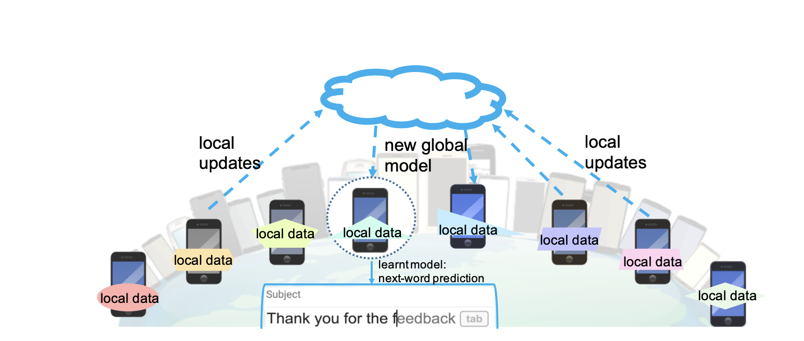

# 30 Days of Federated Learning - Day 1 🎉

*Date: 20th November 2024*

## 📚 Source
**"Federated Learning: Challenges, Methods, and Future Directions"**  
*Tian Li, Anit Kumar Sahu, Ameet Talwalkar, Virginia Smith*  
[Read the paper on arXiv](https://arxiv.org/pdf/1908.07873) 

## Introduction to Federated Learning 🤖🔒

The introduction part of the paper **"Federated Learning: Challenges, Methods, and Future Directions"** by Tian Li et al., provides a comprehensive high-level understanding of federated learning.

Federated learning involves training statistical models across numerous remote devices or siloed data centers, such as mobile phones and hospitals, while keeping the data localized. This approach addresses challenges related to data privacy, limited connectivity, and the complexity of managing heterogeneous and massive networks.

### **Why Federated Learning?** 🌟

- **🔐 Privacy Preservation**: Ensures sensitive data remains on local devices, mitigating privacy risks.
- **📶 Efficient Resource Utilization**: Reduces the need for extensive data transmission, saving bandwidth and battery life.
- **📈 Scalability**: Capable of handling heterogeneous and massive networks, making it suitable for diverse applications.

### **Key Challenges** 🛠️

1. **Data Heterogeneity**: Devices often have non-identically distributed data, complicating the training process.
2. **Limited Connectivity**: Varying network conditions can affect the synchronization and update mechanisms.
3. **Privacy and Security**: Ensuring robust protection against potential data leaks during model updates.

### **Applications of Federated Learning** 🌐

- **📱 Smartphones**: Enhances features like next-word prediction, face detection, and voice recognition without compromising user privacy.
- **🏥 Organizations**: Facilitates collaborative learning in sectors like healthcare, where data sharing is restricted by legal and ethical standards.
- **🚗 Internet of Things (IoT)**: Empowers devices such as wearable trackers, autonomous vehicles, and smart home systems to adapt in real-time based on local data.

### **Example Use Case: Next-Word Prediction on Mobile Phones** 📲✍️

  

1. **🖥️ Local Training**: Selected smartphones train the model on their local text data.
2. **📤 Model Updates**: Phones send only the model updates (not raw data) to the central server.
3. **🌍 Global Aggregation**: The server aggregates updates to refine the global model.
4. **🔄 Model Distribution**: The updated global model is sent back to devices for further training.

This iterative process continues until the model achieves the desired performance, all while preserving user privacy and minimizing network strain.

### **Looking Ahead** 🚀

Next up, we will:

- Dive into problem formulation.
- Implement core algorithms.
- Address key challenges.
- Delve into advanced applications.

Stay tuned in this journey to harness the power of decentralized machine learning!

---

### **References** 📚

- Li, T., Sahu, A. K., Talwalkar, A., & Smith, V. (2019). [Federated Learning: Challenges, Methods, and Future Directions](https://arxiv.org/pdf/1908.07873). *arXiv preprint arXiv:1908.07873*.
- Additional references and resources will be added as we progress through the 30 days.

