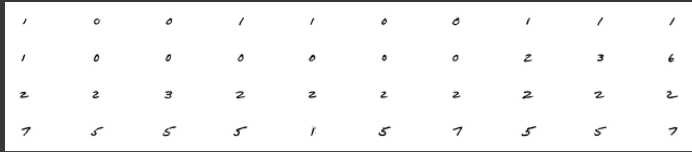
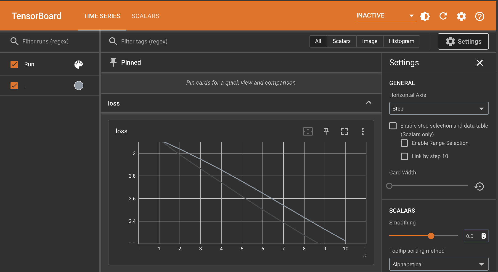

# Day 10 of #30DaysOfFL - Exploring TensorFlow Federated (TFF)

Today, I explored [**TensorFlow Federated (TFF)**](https://www.tensorflow.org/federated/tutorials/federated_learning_for_image_classification) and learned about its Federated Learning (FL) API layer, `tff.learning`. Using the classic MNIST dataset as an example, I gained insights into simulating federated training with non-i.i.d. data.

---

## **Overview of TensorFlow Federated**

TFF provides a robust framework for simulating federated learning scenarios. The EMNIST dataset, a federated version of MNIST, was used to simulate real-world data challenges, where each client's dataset represents handwritten digits from a unique writer. This non-i.i.d. structure exemplifies the heterogeneity in federated systems.

---

### **Key Learnings with Code Snippets**

### **1. Federated Computations and Setup**
I came to know how TFF handles computations across distributed devices, starting with a simple computation to verify the setup.

```python
import tensorflow_federated as tff

tff.federated_computation(lambda: 'Hello, World!')()
```

---

### **2. Federated Dataset Exploration**
The tutorial introduced the `emnist.load_data()` function to load EMNIST data, which is structured by client IDs. I explored the unique handwriting style of a single client by visualizing their dataset.

```python
emnist_train, emnist_test = tff.simulation.datasets.emnist.load_data()

example_dataset = emnist_train.create_tf_dataset_for_client(
    emnist_train.client_ids[0]
)
example_element = next(iter(example_dataset))

from matplotlib import pyplot as plt
plt.imshow(example_element['pixels'].numpy(), cmap='gray')
plt.show()
```
<p align="center">
  
</p>

---

### **3. Data Preprocessing**
I learned how to preprocess the dataset by flattening images, batching, shuffling, and renaming features to make it compatible with TFF.

```python
def preprocess(dataset):
    def batch_format_fn(element):
        return collections.OrderedDict(
            x=tf.reshape(element['pixels'], [-1, 784]),
            y=tf.reshape(element['label'], [-1, 1])
        )
    return dataset.repeat(5).shuffle(100).batch(20).map(batch_format_fn).prefetch(10)

preprocessed_example_dataset = preprocess(example_dataset)
```

---

### **4. Federated Data Preparation**
I discovered how to structure federated datasets by sampling a subset of clients for training and evaluation purposes.

```python
def make_federated_data(client_data, client_ids):
    return [
        preprocess(client_data.create_tf_dataset_for_client(x))
        for x in client_ids
    ]

sample_clients = emnist_train.client_ids[0:10]
federated_train_data = make_federated_data(emnist_train, sample_clients)
```

---

### **5. Building and Wrapping a Keras Model**
The process of creating a simple Keras model and wrapping it with TFF for use in federated computations was intriguing.

```python
def create_keras_model():
    return tf.keras.models.Sequential([
        tf.keras.layers.InputLayer(input_shape=(784,)),
        tf.keras.layers.Dense(10, kernel_initializer='zeros'),
        tf.keras.layers.Softmax(),
    ])

def model_fn():
    keras_model = create_keras_model()
    return tff.learning.models.from_keras_model(
        keras_model,
        input_spec=preprocessed_example_dataset.element_spec,
        loss=tf.keras.losses.SparseCategoricalCrossentropy(),
        metrics=[tf.keras.metrics.SparseCategoricalAccuracy()]
    )
```

---

### **6. Federated Training with Federated Averaging**
I explored how the Federated Averaging (FedAvg) algorithm works and the importance of separate client and server optimizers in FL.

```python
training_process = tff.learning.algorithms.build_weighted_fed_avg(
    model_fn,
    client_optimizer_fn=tff.learning.optimizers.build_sgdm(learning_rate=0.02),
    server_optimizer_fn=tff.learning.optimizers.build_sgdm(learning_rate=1.0)
)

train_state = training_process.initialize()
result = training_process.next(train_state, federated_train_data)
print('Round 1, Metrics:', result.metrics)
```

---

### **7. Visualizing Training Metrics with TensorBoard**
I found that TensorBoard is an excellent tool for visualizing training metrics across rounds in federated learning.

```python
logdir = "/tmp/logs/scalars/training/"
summary_writer = tf.summary.create_file_writer(logdir)

with summary_writer.as_default():
    for round_num in range(1, 11):
        result = training_process.next(train_state, federated_train_data)
        train_state = result.state
        train_metrics = result.metrics
        for name, value in train_metrics['client_work']['train'].items():
            tf.summary.scalar(name, value, step=round_num)

%tensorboard --logdir {logdir}
```

<p align="center">
  
</p>

---

### **8. Evaluating the Federated Model**
Finally, I learned about evaluating the trained model using a federated test dataset and a dedicated evaluation process.

```python
federated_test_data = make_federated_data(emnist_test, sample_clients)
evaluation_process = tff.learning.algorithms.build_fed_eval(model_fn)

evaluation_state = evaluation_process.initialize()
evaluation_output = evaluation_process.next(evaluation_state, federated_test_data)
print('Evaluation Metrics:', evaluation_output.metrics)
```

---

### **Takeaways**
This tutorial offered a comprehensive understanding of federated learning concepts and implementations, including:
- Handling non-i.i.d. datasets in federated systems.
- The Federated Averaging algorithm and its use in FL.
- The role of TensorBoard in monitoring FL experiments.
- Evaluation strategies to validate the model's performance.


