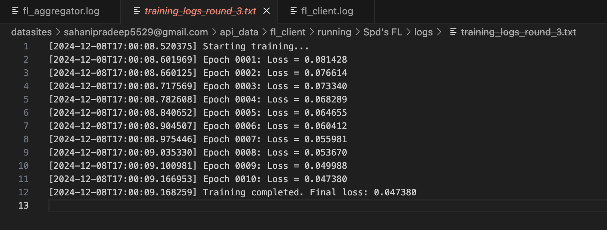
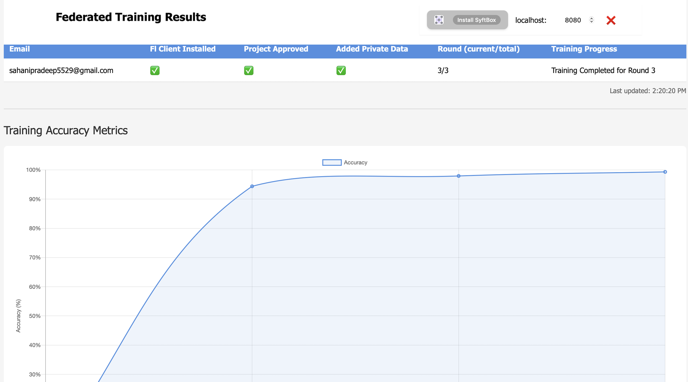

# **Day 14: Federated Learning Code  #30DaysOfFLCode**

This project demonstrates the implementation of Federated Learning (FL) workflows using [**SyftBox**](https://syftbox-documentation.openmined.org), a library designed for privacy-preserving machine learning. It provides an end-to-end implementation of FL where both [**Aggregator**](https://syftbox-documentation.openmined.org/tutorials/federated-learning/getting-started/aggregator) and [**Client**](https://syftbox-documentation.openmined.org/tutorials/federated-learning/getting-started/client) workflows are included. 

---

## **How the System Works**

### **1. Initial Setup and Directory Structure**

The FL system relies on a structured directory hierarchy to organize resources and track progress. These directories ensure seamless communication and management between the aggregator and the clients.

## **Directory Structure**

The project assumes a structured directory setup for smooth operation:

```plaintext
api_data
├── fl_aggregator
│   ├── launch         # FL projects are initialized here.
│   ├── running        # Active projects during training.
│   ├── done           # Archives of completed projects.
└── fl_client
    ├── request        # Contains requests for clients.
    ├── running        # Active FL projects for clients.
    ├── done           # Archives of completed projects.
```

---

#### **Aggregator Directories**
- **`launch`**: Holds project configuration files, model architectures, and initial weights. The aggregator starts new projects from this directory.
- **`running`**: Tracks active projects. Each project gets a dedicated folder containing:
  - `agg_weights`: Aggregated weights for all training rounds.
  - `state`: Tracks project progress (e.g., current round, participant metrics).
  - `fl_clients`: Stores trained models received from clients.
- **`done`**: Archives completed projects for future reference.

#### **Client Directories**
- **`request`**: Stores project requests from the aggregator. Includes configurations, model files, and weights.
- **`running`**: Contains active projects with separate folders for datasets, models, and logs.
- **`done`**: Archives completed projects for the client.

---

### **2. Workflow Execution**

The workflow involves two main roles: **Aggregator** and **Client**. Below is a detailed breakdown of how they work together:

#### **Aggregator Workflow**
1. **Project Initialization:**
   - Reads the `fl_config.json` file from the `launch` directory, which contains:
     - Number of training rounds.
     - Learning rate and optimizer details.
     - List of participants (client identifiers).
     - Model architecture file (`model.py`).
   - Prepares initial weights (`agg_model_round_0.pt`) and shares them with clients.

2. **Sending Requests:**
   - For each project, the aggregator sends the following files to clients:
     - Model architecture (`model.py`).
     - Initial weights (`agg_model_round_0.pt`).
     - FL configuration (`fl_config.json`).

3. **Tracking Progress:**
   - Updates a `participants.json` file to monitor:
     - Training progress for each client.
     - Data contributions and round completions.

4. **Aggregating Models:**
   - Once clients submit their trained models, the aggregator performs weighted averaging:
     ```python
     aggregated_model_weights = {}
     for model_file in trained_model_paths:
         user_model_state = torch.load(model_file)
         for key in global_model_state_dict.keys():
             if aggregated_model_weights.get(key, None) is None:
                 aggregated_model_weights[key] = user_model_state[key] * (1 / n_peers)
             else:
                 aggregated_model_weights[key] += user_model_state[key] * (1 / n_peers)
     ```
   - Saves the aggregated weights as `agg_model_round_<round>.pt`.

5. **Evaluation:**
   - Tests the aggregated model on a predefined dataset to calculate accuracy.
   - Updates `accuracy_metrics.json` with the evaluation results for each round.

6. **Completion:**
   - After all rounds, the project is archived in the `done` folder.

---

#### **Client Workflow**
1. **Receiving Requests:**
   - Clients accept FL project requests from the aggregator.
   - Configurations, model files, and initial weights are stored in the `request` directory.

2. **Preparing Datasets:**
   - Clients use their private datasets stored in `private` directories for training.

3. **Training Models:**
   - Clients train the model locally using the weights received from the aggregator:
     ```python
     for epoch in range(fl_config["epoch"]):
         optimizer.zero_grad()
         outputs = model(images)
         loss = criterion(outputs, labels)
         loss.backward()
         optimizer.step()
     ```
   - Logs training progress, including loss values for each epoch.

<p align="center">
  
</p>

4. **Sharing Updates:**
   - Saves the trained model as `trained_model_round_<round>.pt` and sends it back to the aggregator.

5. **Completion:**
   - Clients repeat the training process for each round until the project is marked complete.

---

### **3. Key Components**

#### **Federated Learning Configuration**
The `fl_config.json` file is the backbone of the system. It defines:
- **Participants:** List of client identifiers.
- **Model Details:** Path to the model file and its architecture class.
- **Training Parameters:** Number of rounds, learning rate, optimizer, and dataset details.

#### **Model Aggregation**
The aggregator combines client models using weighted averaging to create a single global model. This process ensures that client contributions are equally considered without accessing their raw data.

#### **State Tracking**
- **Participants JSON:** Tracks client participation and progress for each round.
- **State Files:** Monitor the overall project lifecycle and ensure smooth coordination.

---

### **4. Challenges and Successes**

#### **Challenges**
- **Directory Management:** Simulating both aggregator and client roles on the same system required careful attention to directory structures. Minor adjustments were needed to resolve conflicts.
- **Testing Environment:** Without collaborators, testing was conducted entirely locally, simulating multiple roles.

#### **Successes**
- Successfully implemented end-to-end Federated Learning workflows using SyftBox.
- Achieved seamless communication and state management between aggregator and clients.
- Overcame challenges with directory structures, ensuring the system worked as intended.

<p align="center">
  
</p>

---

### **Key Learnings**
- Understanding the intricacies of Federated Learning workflows, including:
  - State tracking for multi-round projects.
  - Secure sharing of models and weights.
- Practical experience with SyftBox for managing permissions and directories.
- Designing modular, extensible code for privacy-preserving machine learning.

---


