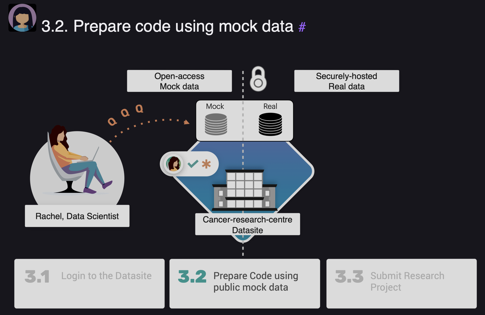

# Day 17: #30DaysOfFLCode 🚀  
**Proposing a Research Study with PySyft**  

---

### What I Studied Today:  
Today, I explored **Part 3: Propose the Research Study** in PySyft. This time, I switched perspectives and studied how a **Data Scientist** (like Rachel) interacts with a Datasite, prepares code using mock data, and submits a research project for approval.  

Here’s a detailed breakdown of my learning:

---

## 1️⃣ Logging into the Datasite as a Data Scientist  
Rachel logs into the **"Cancer Research Centre" Datasite** using the credentials provided by Owen. Once logged in, she can explore the datasets and access mock data to prepare her study.  

### Key Steps:
- **Access the Datasite**:  
  Ensure the Datasite is running using `syft.orchestra.launch`.  
- **Login with Credentials**:  
  Rachel logs in using her assigned email and password.  

### Example Code:
```python
import syft as sy

# Launch the Datasite
data_site = sy.orchestra.launch(name="cancer-research-centre")

# Login as Rachel
client = data_site.login(email="rachel@datascience.inst", password="syftrocks")

# Explore available datasets
print(client.datasets)

# Access a specific dataset by name
bc_dataset = client.datasets["Breast Cancer Biomarker"]

# Extract mock data for features and targets
features, targets = bc_dataset.assets
print(features.mock.head(3))
print(targets.mock.head(3))
```

### Insights:
- Rachel can only access **mock data** (not real data) for experimentation.  
- Mock data allows a Data Scientist to simulate analysis without exposing sensitive information.

---

## 2️⃣ Preparing Code Using Mock Data  
Rachel uses the mock data to design a **machine learning experiment** with the **scikit-learn library**. This ensures that her code will work when run remotely on the real data.  

<p align="center">
  
</p>


code_request = research_project.create_code_request(remote_user_code, client)

### Key Steps:
- **Define the ML Experiment**:
  - Train/Test split.
  - Normalization with `StandardScaler`.
  - Logistic Regression model training.
  - Accuracy evaluation for train/test sets.  

### Example Code:
```python
def ml_experiment_on_breast_cancer_data(features_data, labels, seed: int = 12345) -> tuple[float, float]:
    from sklearn.model_selection import train_test_split
    from sklearn.preprocessing import StandardScaler
    from sklearn.linear_model import LogisticRegression
    from sklearn.metrics import accuracy_score
    
    X, y = features_data, labels.values.ravel()
    
    # 1. Train-Test Split
    X_train, X_test, y_train, y_test = train_test_split(X, y, test_size=0.25, random_state=seed, stratify=y)
    
    # 2. Normalize Features
    scaler = StandardScaler()
    scaler.fit(X_train)
    X_train = scaler.transform(X_train)
    X_test = scaler.transform(X_test)
    
    # 3. Train Logistic Regression
    model = LogisticRegression().fit(X_train, y_train)
    
    # 4. Calculate Accuracy
    acc_train = accuracy_score(y_train, model.predict(X_train))
    acc_test = accuracy_score(y_test, model.predict(X_test))
    
    return acc_train, acc_test

# Test locally on mock data
train_acc, test_acc = ml_experiment_on_breast_cancer_data(features.mock, targets.mock)
print(f"Training Accuracy: {train_acc}, Testing Accuracy: {test_acc}")
```

### Insights:
- Using mock data helps validate assumptions about the data structure and debug code locally.
- Wrapping the ML experiment into a single function prepares it for submission to the Datasite.

---

## 3️⃣ Submitting a Research Project  
With the ML experiment ready, Rachel prepares a **Project** for submission to the Datasite. This ensures that her study is clear and well-documented for Owen's review.

### Key Steps:
1. **Convert the Python Function to a Remote Code Request**:
   - Use the `syft_function_single_use` decorator to transform the local function into a format PySyft can execute remotely.  

2. **Create a Project**:
   - Include a description explaining the purpose of the study.  
   - Attach the remote code request to the project.  

### Example Code:
```python
# Convert the ML function into a remote code request
remote_user_code = sy.syft_function_single_use(features_data=features, labels=targets)(
    ml_experiment_on_breast_cancer_data
)

# Create a research project
description = """
    This study aims to run a machine learning experiment on breast cancer data.
    The pipeline includes normalization (StandardScaler) and logistic regression
    for classification. The goal is to evaluate accuracy on training and testing splits.
"""
research_project = client.create_project(
    name="Breast Cancer ML Project",
    description=description,
    user_email_address="rachel@datascience.inst"
)

# Attach the code request to the project
```

### Insights:
- A **Project** provides transparency about the intent of the study, making it easier for the Data Owner to evaluate requests.  
- Duplicate project names are not allowed, ensuring unique tracking of submissions.

---

## 4️⃣ Approval Workflow  
Rachel’s project is now in the **PENDING** state, awaiting approval from Owen. PySyft enforces strict access control:
- Rachel cannot execute the code until Owen reviews and approves the request.
- If she attempts to force execution, a `SyftError` is raised.

<p align="center">
  
</p>


code_request = research_project.create_code_request(remote_user_code, client)

Example:
```python
client.code.ml_experiment_on_breast_cancer_data(features_data=features, labels=targets)
# SyftError: Request not yet approved!
```

---

### Key Takeaways:  
1. **Secure Mock Data Access**:  
   - Mock data is essential for designing experiments while maintaining privacy.  
2. **Preparing Remote Code**:  
   - Wrapping experiments into functions and converting them into remote code requests simplifies execution on real data.  
3. **Collaborative Workflow**:  
   - Submitting projects with clear descriptions ensures transparency and builds trust between the Data Scientist and Data Owner.  
---
