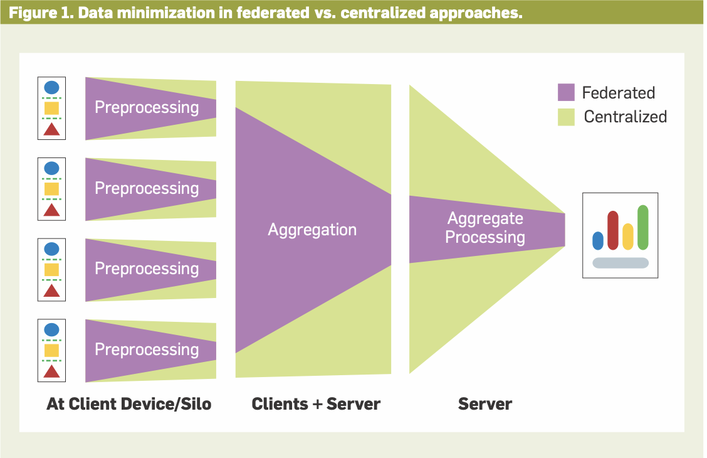

**Day 20 of #30DaysOfFLCode** 
🔍 **Federated Learning: Settings and Applications**  

Today, I explored the foundational concepts, settings, and real-world applications of **Federated Learning (FL)** from [Federated Learning and Privacy](https://dl.acm.org/doi/pdf/10.1145/3500240) . FL is transforming how machine learning models are trained on decentralized data, enabling privacy-preserving workflows in healthcare, finance, and beyond.  

## 🔑 **What is Federated Learning (FL)?**  

FL allows machine learning to be performed on decentralized data by aggregating updates from multiple devices or organizations, **without transferring raw data to a central server**.  

This approach:
- Maintains data privacy and security.
- Handles heterogeneously distributed data across different sources.  
- Involves a **central orchestrator** to manage communication, especially in cases like mobile devices that lack fixed IPs.  

**Why FL Matters**:  
It distinguishes itself from traditional distributed learning in datacenters by keeping data local and adapting algorithms to work with decentralized, often heterogeneous, datasets.

---

## 1️⃣ **Settings in Federated Learning**  

FL primarily operates in two distinct settings:  

### **Cross-Device FL**  
- **Clients**: A large number of mobile or IoT devices (e.g., smartphones).  
- **Use Cases**:  
  - **Mobile keyboard predictions** (used by Google for Android and Apple for iOS).  
  - **Personalized user experiences** on mobile devices while maintaining privacy.  
- **Challenges**:  
  - Managing thousands or millions of devices with intermittent connectivity and limited computational resources.  

---

### **Cross-Silo FL**  
- **Clients**: A smaller number of organizations, institutions, or other data silos.  
- **Use Cases**:  
  - **Healthcare research**: Collaborative studies using sensitive patient data across hospitals (e.g., Google Health, Nvidia).  
  - **Finance**: Secure collaboration between banks and financial institutions (e.g., WeBank, Credit Suisse).  
- **Challenges**:  
  - Handling diverse data silos with different privacy policies and regulations.  

---

## 2️⃣ **Applications of FL**  

### **Cross-Device FL**:  
- Used for **personalized AI** on mobile devices.  
- Examples include:
  - **Keyboard predictions** for better user typing experiences.  
  - **Health tracking** applications where sensitive data remains on devices.  

### **Cross-Silo FL**:  
- Focused on enabling secure collaboration across organizations.  
- Examples include:
  - **Healthcare**: Collaborative cancer studies and patient biomarker research.  
  - **Finance**: Fraud detection using shared insights across multiple banks without exposing sensitive customer data.  

---

## 3️⃣ **Federated Averaging Algorithm**  

The **Federated Averaging Algorithm** introduced in 2017 adapts the **Stochastic Gradient Descent (SGD)** approach for FL settings.  

### Key Features:  
- Clients perform **local updates** on their data (e.g., multiple SGD steps).  
- The server **aggregates the updates** periodically to build the global model. 

  

**Why Federated Averaging Works**:  
- Reduces communication costs by averaging updates less frequently than traditional SGD.  
- Balances efficiency and convergence, enabling feasible training for real-world FL applications.  

---

### 🌟 **Impact of Federated Averaging**:  

- **Key Insight**:  
  Training models with fewer than 1,000 communication rounds showed significant promise for FL.  
  - Language models (e.g., next-word prediction) and image classifiers were successfully trained in days instead of months.  

- **Trade-Off**:  
  - Averaging updates too frequently = Higher communication overhead (similar to traditional SGD).  
  - Averaging updates too infrequently = Model divergence.  
  - **Sweet Spot**: Moderate averaging frequency reduces training time to days while preserving convergence.  

---

### 💡 **Key Takeaways**  

1️⃣ **Empowering Privacy-Preserving AI**:  
   - FL ensures raw data never leaves its source, addressing privacy concerns in sensitive domains like healthcare and finance.  

2️⃣ **Balancing Communication and Convergence**:  
   - The Federated Averaging Algorithm showcases how smart trade-offs can make FL feasible for real-world use.  

3️⃣ **FL is Industry-Ready**:  
   - Companies like Google, Apple, Nvidia, and Intel are actively using FL for personalized AI, healthcare research, and secure collaboration in finance.  

---

FL’s ability to enable **decentralized collaboration at scale** makes it one of the most exciting areas in AI today. By keeping sensitive data local, it addresses many privacy concerns while still unlocking the potential of machine learning for industries like healthcare and finance.  

