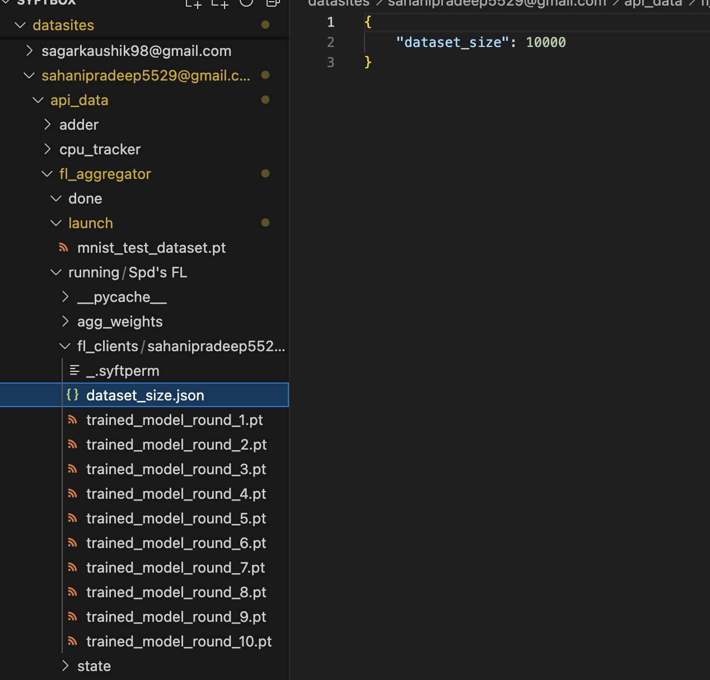
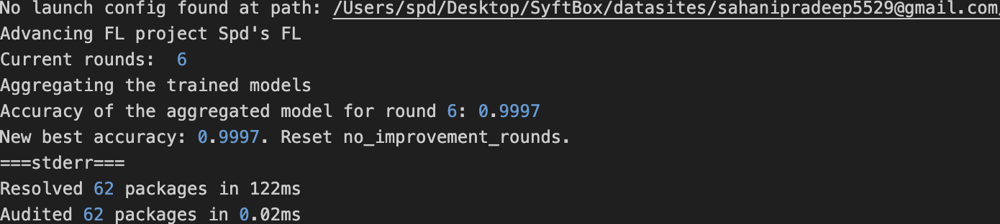
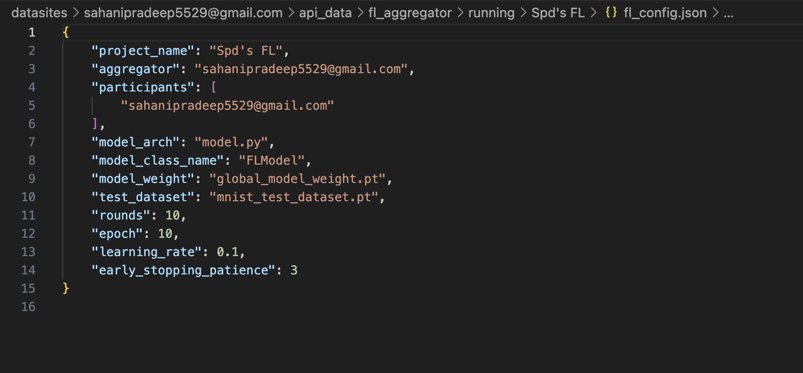
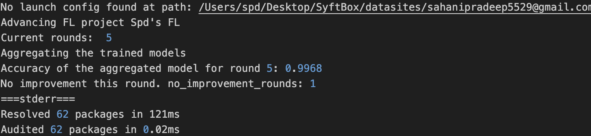
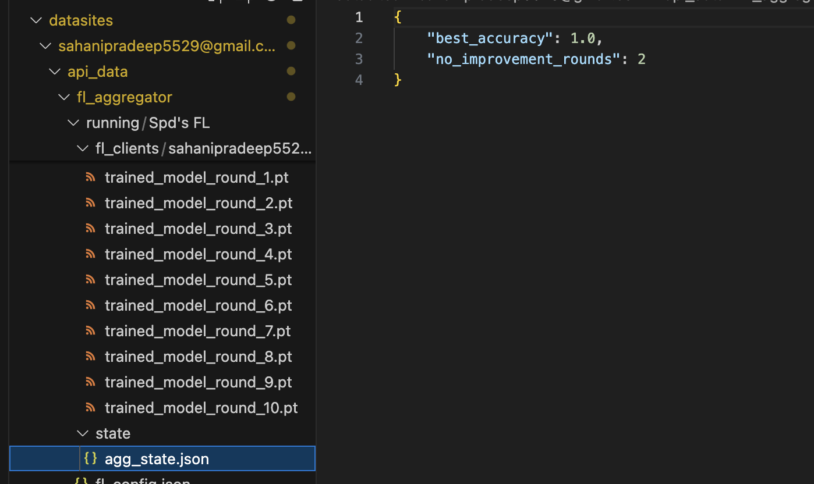

# **Day 21: #30DaysOfFLCode 🚀**  
**Enhancing the FL Client and Aggregator with New Features**

---

Today, I experimented with the **Federated Learning Client** and **Aggregator**, focusing on adding enhancements that improve the robustness, efficiency, and usability of FL workflows. Here’s a summary of the cool features I’ve been exploring:

---

## 🛠️ **What I Implemented**  

### 1️⃣ **Weighted Aggregation by Dataset Size**  
- **What I Did**:  
   I modified the **Aggregator** to account for each participant's dataset size when combining local models. 

---

  

 

---
- **Why It Matters**:  
   - Clients contributing **more data** now have a **greater influence** on the global model.  
   - This approach ensures that the global model becomes more representative and accurate, particularly when dataset sizes vary significantly across participants.  
- **Outcome**:  
   Improved fairness and relevance of aggregated model updates.

---

  

---

### 2️⃣ **Early Stopping with No-Improvement Tracking**  
- **What I Did**:  
   I introduced an **early stopping mechanism** to automatically halt training when the global model’s accuracy stops improving.  

  

- **How It Works**:  
   - Tracks the **best accuracy achieved so far**.  
   - Counts the number of consecutive rounds where accuracy hasn’t improved.  
   - If the "no-improvement" counter exceeds a threshold, training stops.  
   - When accuracy improves, the counter resets to **zero**.  
- **Why It Matters**:  
   - Saves computation time and resources.  
   - Prevents overfitting and avoids running unnecessary training rounds.  
- **Outcome**:  
   More efficient training while maintaining model performance.

  

---

### 3️⃣ **Persistent Aggregator State**  
- **What I Did**:  
   I implemented a way to persist **aggregator state** information by saving it to a file called `agg_state.json`.  
- **What’s Tracked**:  
   - **Best accuracy** achieved so far.  
   - **No-improvement count** to resume early stopping logic seamlessly.  
- **Why It Matters**:  
   - Makes it easier to **pause, resume, or debug** the training process.  
   - Reduces risks of losing progress in case of system interruptions.  
- **Outcome**:  
   Greater flexibility and reliability for long-running FL projects.

  

---

### 4️⃣ **Finalizing Training Loss Logs**  
- **What I Did**:  
   - Recorded **training loss** for each round in JSON files: `training_loss_round_{round_num}.json`.  
   - Moved the training loss logs to the **client’s public folder** at the end of training.  
- **Why It Matters**:  
   - Keeps training logs organized and accessible.  
   - Makes it easier to **analyze model performance** and **debug issues** post-training.  
- **Outcome**:  
   Clearer insights into training loss trends and better documentation of FL experiments.

---

## 📂 **Where It’s Stored**  
- **Aggregator State**: Saved to `agg_state.json`.  
- **Training Loss Logs**: Saved in individual JSON files (one per round) in the client’s public folder.  

---

##  **Next Steps**  
These enhancements are currently local experiments, but I’m excited to test them further with additional clients. If these features prove useful, we can consider integrating them into the broader FL framework.  

- **Weighted Aggregation** → Optimizing model fairness for diverse datasets.  
- **Early Stopping** → Ensuring efficient and resource-friendly training.  
- **Persistent State** → Improving recovery and troubleshooting capabilities.  
- **Loss Logging** → Enabling better post-training analysis.

---

## 💬 **Let’s Collaborate!**  
If you’re experimenting with FL or have ideas for improving these features, I’d love to collaborate and test this with more clients. Let’s make FL workflows smarter and more efficient together! 🚀  

---

