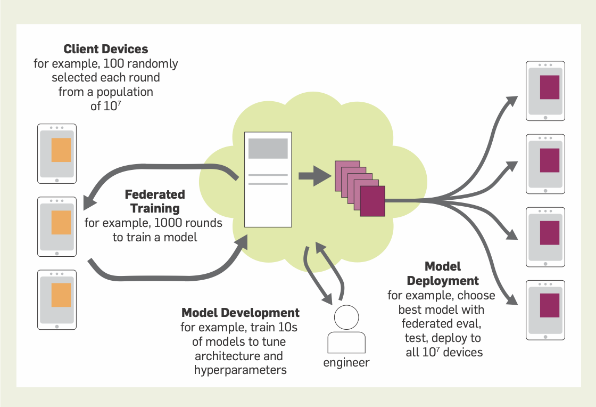

# **Day 22 of #30DaysOfFLCode 🚀**  
**Workflows, Systems, and Privacy in Cross-Device Federated Learning**  

**Continuing from the insights in [Federated Learning and Privacy](https://dl.acm.org/doi/pdf/10.1145/3500240) and building on Day 20**, I delved deeper into the **workflows, systems, and privacy considerations** that power **Cross-Device Federated Learning (FL)** at scale. Google’s practical approach offers a fascinating lens into how FL transforms real-world machine learning pipelines—while keeping data local and private.

---

## 1️⃣ **Core Workflow Phases**  

### **(A) Problem Identification**  
- **On-Device Model**: Typically aiming for **1MB–50MB** size.  
- **Richer Local Data**: Ideal when device data is more representative or private than datacenter data.  
- **Readily Available Feedback Signals**: For example, next-word prediction uses on-device typed text (while respecting user privacy).

### **(B) Model Development & Evaluation**  
- **Initial Simulation**: Use datacenter or proxy data to select the right model architecture and hyperparameters.  
- **Real-Device Training**: Final fine-tuning and evaluation must happen on actual devices, reflecting the reality of intermittent connectivity and varied data distributions.  
- **Federated Evaluation**:  
  - Send candidate models to held-out devices.  
  - Aggregate performance metrics from local datasets.  
  - Consider both **average accuracy** and **per-client histograms** for a comprehensive view.  
- **Infrastructure Demands**:  
  - **High-performance FL simulation** tools that mirror real-world conditions.  
  - **Cross-device orchestration** for simultaneous training and evaluation tasks.

### **(C) Deployment**  
- **Validation and A/B Testing**: Compare the newly trained model with the current production model.  
- **Staged Rollout**: Gradually roll out the model to a broad device fleet—often far larger than the training subset.  
- **User Experience Safeguards**:  
  - Heavy computations only run when devices are idle, plugged in, and connected to unmetered Wi-Fi.  
  - FL training does **not** make user-facing predictions unless explicitly deployed.

  

 
---

## 2️⃣ **Privacy in Federated Learning**  

FL naturally aligns with **data minimization**—raw data remains on the device, and only aggregated updates are shared. That said, true privacy requires careful attention:

- **Encryption & Ephemeral Access**:  
  - End-to-end encryption secures updates.  
  - Decryption keys are **not** persisted, existing only briefly in memory.  
- **Formal Guarantees**:  
  - Techniques like **differential privacy** and **anonymous aggregation** can further reduce risks of leaking individual data.  
  - Balancing **fairness, accuracy, and computational cost** against stronger privacy constraints is a non-trivial challenge.  
- **Threat Models**:  
  - **Device-Level**: Protect raw on-device data.  
  - **Network & Server**: Safeguard in-transit updates and limit access to coordinating servers.  
  - **Released Models**: Ensure final models don’t inadvertently memorize and reveal user data.

---

## 3️⃣ **Why This Matters**  

- **Scalable FL Infrastructure**: Building intuitive APIs and robust backend systems is critical to manage massive cross-device training and evaluation.  
- **Privacy-First Design**: FL’s architectural principles reduce privacy risks by design, but additional privacy-enhancing techniques are often needed.  
- **Real-World Impact**:  
  - **Google’s Production Systems**: Examples show FL is not just academic—it’s shaping products like keyboard suggestions on billions of devices.  
  - **Future Outlook**: As privacy regulations tighten and consumers demand better data protection, FL’s decentralized approach becomes even more relevant.

---

## 💡 **Key Takeaways**  

1️⃣ **End-to-End FL Workflow**: From **problem identification** through **deployment**, each stage must address unique cross-device challenges (connectivity, data distribution, device heterogeneity).  

2️⃣ **Privacy & Security**: FL offers built-in privacy benefits, but real-world systems must layer techniques like encryption, differential privacy, and anonymized aggregation.  

3️⃣ **Flexibility vs. Formal Guarantees**: A one-size-fits-all privacy solution is unlikely—teams weigh privacy requirements against product goals and system constraints.

