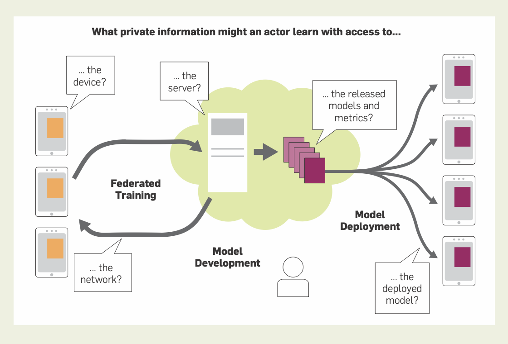

## **Day 23 of #30DaysOfFLCode**  
**Differential Privacy and Federated Analytics in Federated Learning**

Wrapping up the final section of [**Federated Learning and Privacy**](https://dl.acm.org/doi/pdf/10.1145/3500240), I explored how **differential privacy (DP)**, **anonymous aggregation**, and **federated analytics (FA)** augment federated learning to safeguard user data while still deriving valuable insights. Here’s what stood out for me:

---

### 1️⃣ **Anonymous Aggregates and Differential Privacy**  
- **DP & Model Training**:  
  - The **gold-standard** approach for anonymization and limiting user influence on the model.  
  - **DP-SGD**: Gradients are clipped and randomized noise is added, ensuring a model can’t reliably reveal any single user’s data.  
- **User-Level DP**:  
  - Goes beyond example-level DP by bounding all data from a single user.  
  - Crucial for cross-device FL, where a single user may contribute multiple data points.  
- **Distributed DP**:  
  - Avoids relying solely on a trusted server.  
  - Clients add local noise, and private aggregation protocols ensure the server only sees an aggregated (already-differentially-private) sum.

---

### 2️⃣ **Model Auditing Techniques**  
- Empirical approaches to assess how much a model might “memorize” unique or rare user data.  
- Even if DP noise is not sufficient to guarantee a small formal privacy budget (ε), **limiting user influence** still often reduces real-world data leakage.  
- Auditing helps catch possible vulnerabilities and ensures real systems align with theoretical guarantees.

---

### 3️⃣ **Federated Analytics (FA)**  
- **Beyond Model Training**:  
  - FA addresses data science tasks like **counts, averages, histograms, quantiles**, and more.  
  - Similar to FL, it keeps raw data on devices but focuses on **aggregated statistics** rather than model updates.  
- **Key Differences from FL**:  
  1. **Fewer Rounds, More Clients**: FA tasks often benefit from a single or few large rounds with many clients.  
  2. **Client Participation**: Typically, clients shouldn’t participate repeatedly to avoid bias in results.  
  3. **Sparse Aggregation**: Handling large, sparse datasets is crucial (e.g., capturing the top played songs).  
- **Practical Example**:  
  - Computing the top 10 most played songs across user devices while preserving privacy via distributed DP.

  

 
---

### 4️⃣ **Why This Matters**  
1. **Stronger Privacy Protections**: DP, especially **user-level DP**, limits how much each individual’s data can influence the model or aggregate statistic.  
2. **Scalable Applications**: FA extends FL principles to a broader range of analytical queries, allowing organizations to gather insights without centralizing raw data.  
3. **End-to-End Solutions**: Combined with robust auditing techniques, these approaches tackle real-world challenges—balancing data utility, privacy, and regulatory requirements.

---

## **Key Takeaways**  
- **Differential Privacy is crucial** for limiting how much sensitive information can leak during model training and analytics.  
- **Federated Analytics** supports essential data science tasks beyond model training, maintaining privacy by design.  
- **Auditing and Distributed DP** help verify real-world FL deployments match theoretical privacy guarantees.

---
