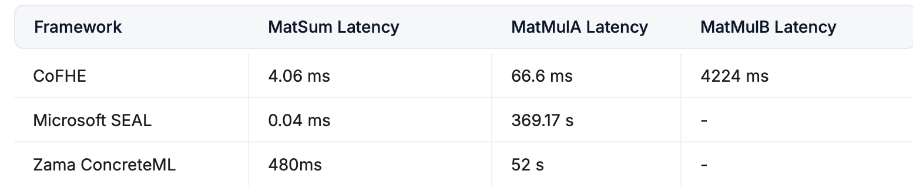

 **Day 24 of #30DaysOfFLCode** 🚀  
**Revolutionizing Confidential Computation with OpenVector's CoFHE**  

Today, I delved into the cutting-edge advancements in **confidential computation**, focusing on how [**OpenVector**](https://openvector.gitbook.io/docs/introduction/quickstart) is pioneering a new cryptographic primitive called **CoFHE (Collaborative-Fully Homomorphic Encryption)**. This innovation aims to bridge the gap between privacy and performance in AI-driven applications.

### **🔍 Key Insights**

1️⃣ **Challenges with Existing Techniques**  
   - **Fully Homomorphic Encryption (FHE)**: While powerful, FHE suffers from extreme computational overhead, making real-time AI applications impractical. Operations like bootstrapping are time-consuming, hindering scalability.
   - **Multi-Party Computation (MPC)**: MPC methods face high compute and communication costs, especially for complex models like transformers, leading to inefficiencies and potential privacy breaches.
   - **Trusted Execution Environments (TEEs)**: TEEs rely on centralized trust, introducing vulnerabilities as any trusted party (e.g., cloud providers) can potentially compromise the system.

2️⃣ **Introducing CoFHE**  
   - **Speed and Efficiency**: CoFHE achieves speeds approximately **1000 times faster** than traditional FHE by eliminating the need for bootstrapping and reducing communication bandwidth overhead.
   - **Scalability**: Designed to scale with GPU compute, CoFHE supports large models (e.g., 50 billion parameters) with efficient token generation (3-4 tokens/sec), making it viable for real-time AI applications.
   - **Decentralized and Confidential**: CoFHE enables decentralized AI use cases, ensuring data remains confidential without relying on a fully trusted central server.

3️⃣ **Benchmarking Results**  
   - **Performance Comparison**:  
     - **CoFHE**: Significantly reduced latency for matrix operations (MatSum, MatMulA, MatMulB) by leveraging GPU parallelism.
     - **Microsoft Seal (CKKS)** and **Zama's Concrete (tFHE)**: Showed substantial performance drops (5-7 orders of magnitude) compared to CoFHE, highlighting CoFHE's superior efficiency.
   - **No Bootstrapping Required**: This key feature allows CoFHE to maintain low latency and high throughput, essential for practical AI-based applications.

  

 
---

### **🌟 Why CoFHE Matters**

- **Empowering Confidential AI**: CoFHE makes privacy-preserving AI feasible for a wide range of applications, from healthcare to finance, by ensuring data remains encrypted during computation.
- **Overcoming FHE Limitations**: By addressing the core performance bottlenecks of FHE, CoFHE paves the way for scalable, secure AI models that can operate in real-time environments.
- **Future-Ready Infrastructure**: As AI continues to evolve, having robust, efficient, and secure computation methods like CoFHE will be crucial for maintaining data privacy and trust.

---
