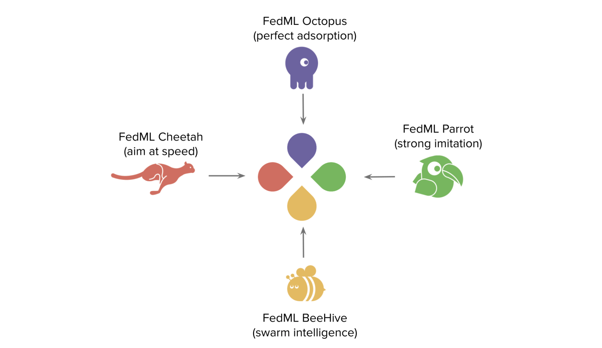
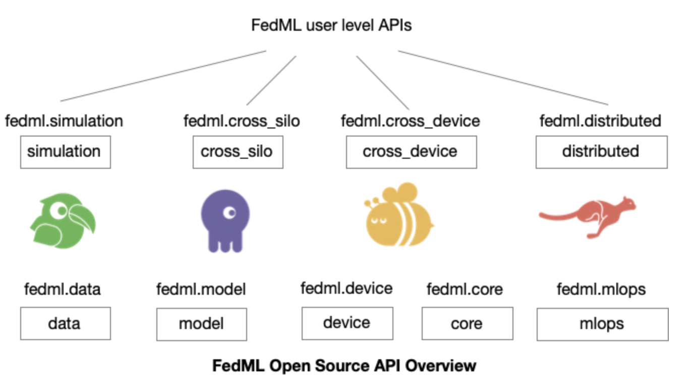

# **Day 27 of #30DaysOfFLCode** 🚀  
**Deep Dive into FedML: Simplifying Federated Learning Across Scales**  

Today, I began exploring **FedML**, an open-source library aimed at making **federated learning (FL)** simple and scalable for research and production use cases. FedML provides a modular design that supports simulation, cross-silo federated learning for organizations, and cross-device federated learning for smartphones and IoT devices. This framework enables seamless experimentation, efficient deployment, and end-to-end support for real-world FL workflows.

<p align="center">
  
</p> 

---

## **🔍 What Makes FedML Unique?**

1. **Supports Diverse FL Use Cases**:  
   - **Simulation**: Lightweight testing for academic research or quick proofs of concept.  
   - **Cross-Silo FL**: Ideal for organizational collaborations (e.g., hospitals, banks).  
   - **Cross-Device FL**: Perfect for mobile devices and IoT setups.  

2. **Simplified APIs**: FedML is designed to minimize complexity with one-liner commands for basic tasks while retaining flexibility for advanced configurations.

<p align="center">
  
</p> 

3. **Seamless MLOps Integration**:  
   With support for TensorOpera AI, FedML bridges the gap between research and production by enabling machine learning anywhere at any scale.

---

## **⚙️ Getting Started**

### **Installation**  
FedML can be installed easily using pip:  
```bash
pip install fedml
```

For additional setup options, check out the [FedML Installation Guide](https://github.com/FedML-AI/FedML).

---

## **🚀 Running a Simulation with One Line**

To get started with a simulation, use the following code:  
```python
import fedml

if __name__ == "__main__":
    fedml.run_simulation()
```

### **What Happens?**  
1. FedML initializes a simulation backend (e.g., single-process, MPI, or NCCL).  
2. A dataset like MNIST is partitioned across multiple simulated clients.  
3. Federated averaging (FedAvg) is applied to aggregate the models trained on client datasets.  

**Output Example**:  
```plaintext
[FedML-Server(0)]: Dataset: mnist, Clients: 10, Rounds: 50, Algorithm: FedAvg
...
[FedML-Server(0)]: Round 1: Training completed with accuracy 88.5%.
...
[FedML-Server(0)]: Final Accuracy after Round 50: 92.3%.
```

---

## **🔑 Exploring FedML Modules**

FedML offers several modules tailored to different federated learning scenarios.

---

### **1️⃣ Core Functionality**  

At the heart of FedML is the **core** module, which manages:  
- **Communication Backends**: Supports MPI, NCCL, PyTorch RPC, and more.  
- **Topology Management**: Defines how nodes in the network interact.  
- **Privacy Mechanisms**: Implements encryption and differential privacy.

#### **Example: MPI Backend Initialization**  
```python
from fedml.core import mpi_backend

backend = mpi_backend.MPIBackend()
backend.initialize()
print("MPI Backend Initialized Successfully!")
```

---

### **2️⃣ Simulation**  

FedML simplifies simulation for both research and quick prototyping.  

#### **Single-Process Simulation**  
Run FL on your laptop using a single process:  
```python
from fedml.simulation import run_fedavg

run_fedavg(dataset="mnist", model="lr", num_clients=10, num_rounds=50)
```

#### **Multi-Process Simulation**  
For larger datasets or faster experimentation, use MPI:  
```bash
mpirun -np 4 python examples/simulation_mpi_fedavg_mnist_lr.py
```

#### **NCCL-Based Simulation**  
For high-performance GPUs with fast interconnects (e.g., NVLink):  
```bash
mpirun -np 4 python examples/simulation_nccl_fedavg_mnist_lr.py
```

---

### **3️⃣ Cross-Silo FL**  

This module facilitates FL across organizations. Each client is typically a data silo (e.g., hospitals) that holds sensitive data.

#### **Setting Up Cross-Silo FL**  
```python
from fedml import FedMLRunner

# Initialize FedML
args = fedml.init()

# Load data and models
dataset, output_dim = fedml.data.load(args)
model = fedml.model.create(args, output_dim)

# Start training across silos
FedMLRunner(args, device, dataset, model).run()
```

#### **Example Configuration for Cross-Silo FL**  
FedML uses YAML configuration files to simplify hyperparameter tuning. Here's an example for MNIST:  
```yaml
common_args:
  training_type: 'cross_silo'
  random_seed: 42

data_args:
  dataset: 'mnist'
  partition_method: 'hetero'
  partition_alpha: 0.5

train_args:
  federated_optimizer: 'FedAvg'
  client_num_per_round: 2
  comm_round: 10
  epochs: 1
  batch_size: 10
  client_optimizer: sgd
  learning_rate: 0.01
```

---

### **4️⃣ Cross-Device FL**  

FedML’s `cross_device` module extends FL capabilities to edge devices like smartphones and IoT.

#### **Basic Cross-Device FL Example**  
```python
import fedml

args = fedml.init_edge()
fedml.edge_runner(args).run()
```

### **Why This Matters**  
Cross-device FL ensures privacy and efficiency by keeping data on the devices where it is generated.

---

## **🌟 Key Highlights**

1. **Simulation Made Easy**: Whether you're an academic researcher or an industry practitioner, FedML offers tools to experiment with FL algorithms quickly.  
2. **Customizable Configurations**: YAML-based hyperparameter tuning allows you to adapt FedML to your specific needs.  
3. **Cross-Silo and Cross-Device Support**: Enables real-world applications where data privacy and decentralization are critical.  
4. **Scalability**: From small-scale setups to large-scale deployments, FedML can handle it all.

---

## **What’s Next?**  

1. **Prebuilt Jobs Example**  
2. **Datsets and Models** 
3. **Customizing Dataloader**:

---

