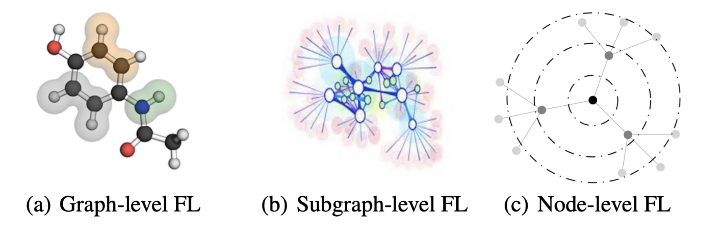
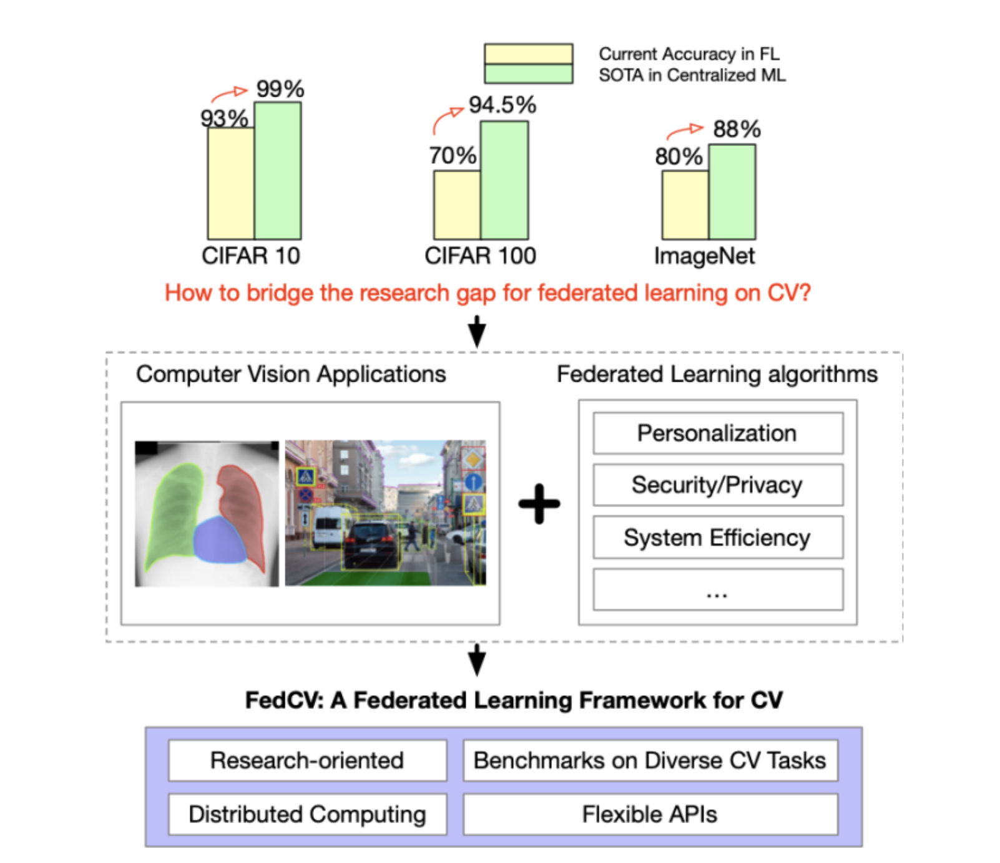
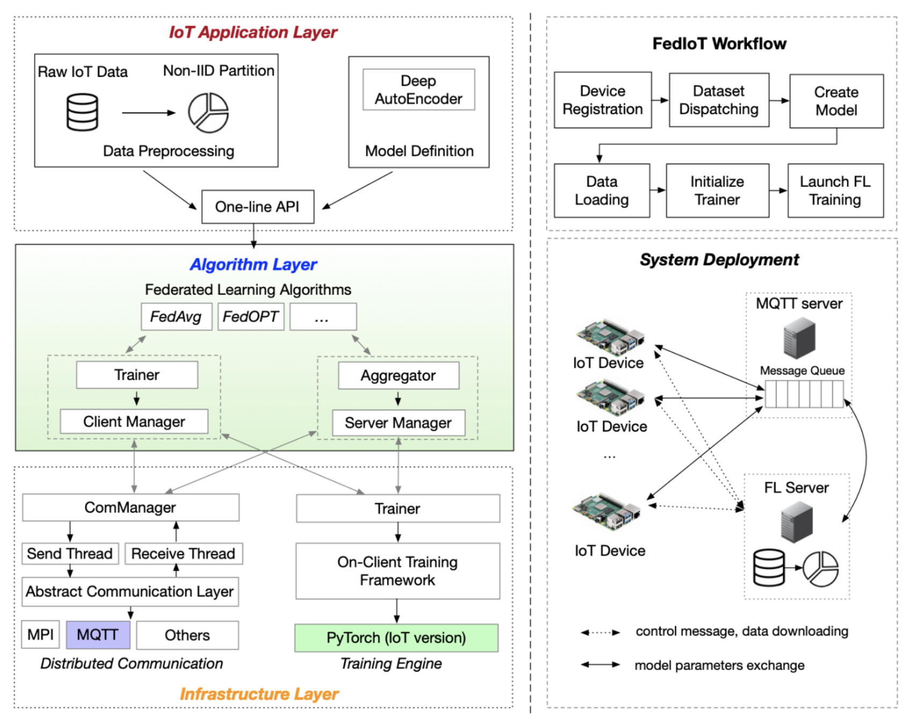

# **Day 28 of #30DaysOfFLCode** 🚀  
**Exploring Pre-Built Jobs and Examples in FedML**

Continuing from Yesterday, I dove into [**FedML’s pre-built jobs and examples**](https://docs.tensoropera.ai/federate/examples), which provide tailored solutions for federated learning (FL) across various domains like NLP, computer vision, graph neural networks, and IoT. These pre-built modules and benchmarks simplify FL implementation, offering researchers and practitioners practical tools to explore diverse use cases.

---

## **🔍 Key Highlights**

### **1️⃣ Examples for Diverse FL Scenarios**  
FedML supports simulations, cross-silo FL, and cross-device FL. Its modular architecture works seamlessly with multiple machine learning frameworks, including PyTorch, TensorFlow, JAX, and MXNet.

#### **Example Use Cases**:  
- **Single-Process Simulation**: Quick algorithmic prototyping for small datasets.  
- **Distributed FL**: MPI-based and NCCL-accelerated training for large-scale GPU setups.  
- **Cross-Silo FL**: Secure collaboration across organizations, such as hospitals or banks.  
- **Cross-Device FL**: Federated learning for smartphones and IoT.

[Explore examples here](https://github.com/FedML-AI/FedML/blob/master/python/examples/README.md).

---

### **2️⃣ Pre-Built Jobs for FL Applications**  

FedML provides pre-built frameworks for specific FL applications, enabling targeted research and deployment across domains:

#### **FedNLP**: Federated Learning for NLP  
- Benchmarks FL methods for tasks like text classification, sequence tagging, and question answering.  
- Integrates models like BERT and BART with FL algorithms (e.g., FedAvg, FedOPT).  
- Published at [NAACL 2022](https://arxiv.org/pdf/2104.08815.pdf).

#### **FedGraphNN**: Federated Learning for Graph Neural Networks  
- Focuses on privacy-preserving training for graph-structured data.  
- Includes 36 datasets spanning seven domains (e.g., Tencent, hERG).  
- Addresses challenges in non-IID data and FL-specific GNN performance.  
- Published at [FL-AAAI 2022](https://arxiv.org/pdf/2104.07145.pdf).

  

 

#### **FedCV**: Federated Learning for Computer Vision  
- Supports advanced CV tasks like object detection, image segmentation, and classification.  
- Includes non-IID benchmarking datasets and reference FL algorithms.  
- Published at [ICLR’21 and MLSys’21 workshops](https://arxiv.org/pdf/2111.11066.pdf).

  

 

#### **FedIoT**: Federated Learning for IoT  
- Addresses cybersecurity challenges (e.g., anomaly detection) while preserving data privacy.  
- Includes FedDetect, a framework for detecting attacks in IoT environments.  
- Evaluated on real IoT devices (e.g., Raspberry Pi).  
- Published at [ACM Sensys 2021](https://arxiv.org/pdf/2106.07976.pdf).

  

 

---

## **⚙️ Why These Pre-Built Jobs Matter**

1. **Accelerated Research**:  
   - Pre-built frameworks provide plug-and-play solutions for advanced FL scenarios.  
   - Benchmarks highlight the strengths and limitations of FL in different domains.  

2. **Targeted Applications**:  
   - Each module is tailored to specific challenges, like privacy in NLP, efficiency in IoT, or non-IID data in CV and GNNs.  

3. **Real-World Relevance**:  
   - Evaluations on realistic devices (e.g., IoT setups) and datasets ensure practical applicability.  

---

## **💡 Key Takeaways**

- **FedNLP**: Bridges FL and natural language processing, addressing privacy and non-IID challenges in text tasks.  
- **FedGraphNN**: Highlights the complexities of graph FL and the need for more research in this space.  
- **FedCV**: Expands FL to advanced CV tasks, demonstrating its utility beyond basic classification.  
- **FedIoT**: Shows FL’s potential in securing IoT environments through privacy-preserving anomaly detection.
