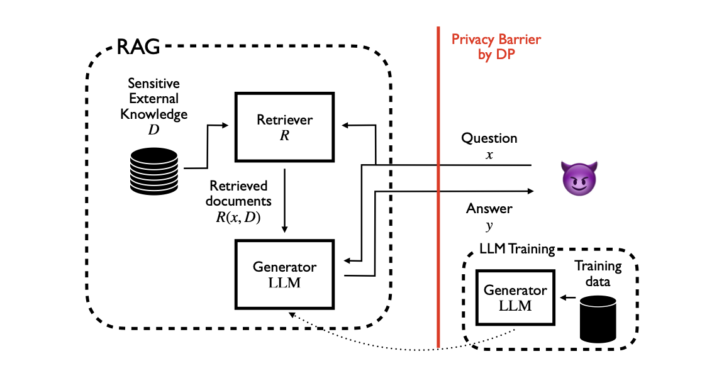
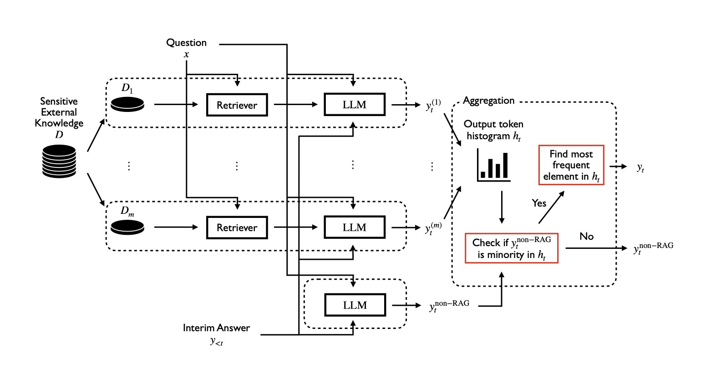

# **Day 29 of #30DaysOfFLCode** 🚀  
**Exploring Privacy-Preserving Retrieval Augmented Generation (RAG) with Differential Privacy**

I explored the foundational concepts in the paper [**“Privacy-Preserving Retrieval Augmented Generation with Differential Privacy”**](https://arxiv.org/pdf/2412.04697). This research delves into how **Retrieval Augmented Generation (RAG)** can be enhanced with **Differential Privacy (DP)** to protect sensitive data while maintaining high-quality outputs in knowledge-intensive tasks.

---

## **🔍 Why RAG with DP?**

**RAG** enhances **Large Language Models (LLMs)** by incorporating relevant information from external knowledge sources. This is particularly useful for domain-specific applications such as:  
- Healthcare (e.g., using medical records to provide tailored responses).  
- Legal research (e.g., leveraging case archives for drafting legal documents).  

However, when RAG retrieves sensitive documents, there’s a risk of leaking private information. This necessitates the integration of **Differential Privacy** to ensure that sensitive data remains protected while maintaining the utility of the generated responses.

---

## **Key Challenges**  

1. **Integrating DP into RAG**:  
   Adapting differential privacy within the RAG framework to minimize leakage while retaining functionality.  

2. **Privacy-Utility Tradeoff**:  
   Balancing privacy guarantees with the quality and length of generated responses.  

  

 

---

## **Proposed Algorithms**

The paper introduces two novel algorithms: **DPVoteRAG** and **DPSparseVoteRAG**, which address the above challenges by optimizing privacy budget usage.

---

### **1️⃣ DPVoteRAG: Differentially Private Voting for RAG**

**Concept**:  
DPVoteRAG adapts the **sample-and-aggregate framework** for RAG. It partitions the sensitive data into disjoint subsets, allowing multiple LLM instances (voters) to generate outputs independently. A voting mechanism is then used to aggregate the results while ensuring differential privacy.  

#### **Algorithm Steps**:  
1. **Partition Data**: Divide the sensitive data source \( D \) into \( m \) disjoint subsets: \( D_1, D_2, \dots, D_m \).  
2. **Generate Tokens**: For each subset, LLMs retrieve documents and generate token outputs for the given prompt.  
3. **Aggregate Outputs**: Create a histogram of tokens and apply a DP mechanism (e.g., LimitedDomain) to select the most frequent token.  
4. **Append Token**: Append the chosen token to the response sequence.  
5. **Repeat**: Continue until the end-of-sequence token or the privacy budget is exhausted.

#### **Key Innovation**:  
The **LimitedDomain mechanism** reduces histogram dimensionality, optimizing the privacy-utility tradeoff.

---

### **2️⃣ DPSparseVoteRAG: Optimized Privacy Budget Usage**

**Concept**:  
DPSparseVoteRAG improves upon DPVoteRAG by incorporating the **Sparse Vector Technique** to conserve the privacy budget. It differentiates between tokens that rely on sensitive data and those that don’t, spending the budget only when necessary.  

  

 

#### **Algorithm Steps**:  
1. **Baseline Token Generation**: Use a non-RAG LLM (no sensitive context) to generate baseline tokens.  
2. **Token Comparison**: For each token:  
   - If the RAG and non-RAG tokens match, use the non-RAG token (no budget spent).  
   - If they differ, apply DP to the RAG histogram to select a token.  
3. **Adjust Privacy Budget**: Update the privacy budget only when sensitive data contributes to the output.  
4. **Repeat**: Continue until the response sequence is complete or the privacy budget is exhausted.

#### **Key Advantage**:  
This approach allows the algorithm to generate longer, accurate responses by avoiding unnecessary budget expenditure.

---

### **Algorithm Comparison**

| Feature                   | **DPVoteRAG**                       | **DPSparseVoteRAG**                    |
|---------------------------|-------------------------------------|----------------------------------------|
| **Privacy Budget Usage**  | Spent for each token generated.     | Spent only when sensitive data is used. |
| **Output Length**         | Limited by total privacy budget.    | Supports longer outputs.               |
| **Complexity**            | Simpler implementation.             | Requires additional token comparison.  |

---

### **Illustrative Example**

**Question**: "What type of literature is *The Great Gatsby*?"  

- **Non-Private RAG**: "The Great Gatsby is a novel written by American author F. Scott Fitzgerald."  
- **DPVoteRAG**: "The Great Gatsby is a" (halts due to budget exhaustion).  
- **DPSparseVoteRAG**: "The Great Gatsby is a novel written by American author" (optimized budget usage).

---

## **Empirical Results**

The algorithms were tested on multiple datasets with pre-trained LLMs. Key findings include:  
- **DPVoteRAG**: Effective for short, privacy-sensitive responses.  
- **DPSparseVoteRAG**: Generated longer, high-quality responses within a reasonable privacy budget (\( \epsilon \approx 10 \)).

---

## **Why This Matters**

1. **Enhanced Privacy for Sensitive Domains**:  
   These algorithms enable secure deployment of LLMs in privacy-sensitive fields like healthcare and law.  

2. **Practical Utility**:  
   By optimizing budget usage, DPSparseVoteRAG strikes a balance between privacy guarantees and real-world applicability.  

3. **Scalable Solutions**:  
   The modular design supports diverse datasets and application scenarios.

---