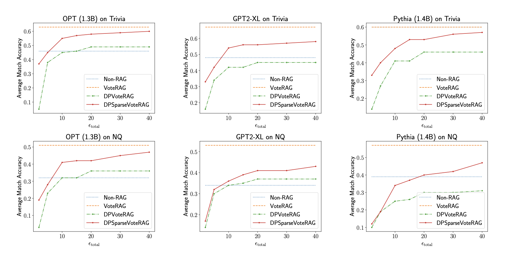

# **Day 30 of #30DaysOfFLCode** 
**Concluding with Privacy-Preserving Retrieval Augmented Generation (RAG) Using Differential Privacy**  

Today, I wrapped up my journey by diving deeper into the evaluation and insights from the paper [**“Privacy-Preserving Retrieval Augmented Generation with Differential Privacy”**](https://arxiv.org/pdf/2412.04697). This exploration not only highlighted the **practical benefits** of privacy-preserving algorithms but also offered a fitting end to this 30-day challenge.

---

## **🔍 Evaluation Insights**

### **Key Questions Investigated**  
1️⃣ How do these algorithms improve the accuracy of question-answering (QA) over non-RAG LLMs while ensuring privacy?  
2️⃣ Is **DPSparseVoteRAG** always better than **DPVoteRAG**?  
3️⃣ How do hyperparameters (e.g., number of voters \(m\), per-token privacy budget \(ϵ_token\) affect performance?

---

## **📊 Experimental Setup**  

- **Datasets**: Trivia and Natural Questions (NQ), using Wikipedia as the external knowledge source.  
- **Models**: Dense Passage Retriever (DPR) for retrieval; LLMs like OPT (1.3B), GPT2-XL, and Pythia (1.4B).  
- **Algorithms**:  
   - **Non-RAG**: Baseline without retrieved documents.  
   - **VoteRAG**: Non-private token voting.  
   - **DPVoteRAG** (Algorithm 1): Differentially private voting.  
   - **DPSparseVoteRAG** (Algorithm 2): Efficient privacy budget spending with sparse vector optimization.  
- **Metrics**: Match Accuracy (measuring if the prediction contains any correct answers).

---

## **🔑 Key Results**

  

 

### **1️⃣ Comparison of Algorithms**  
- **VoteRAG** consistently outperformed Non-RAG, demonstrating the utility of retrieval in knowledge-intensive tasks.  
- **DPSparseVoteRAG** surpassed both Non-RAG and DPVoteRAG under moderate privacy budgets (ϵtotal≥10).  
- **DPVoteRAG** often required higher privacy budgets to match or surpass Non-RAG performance.

### **2️⃣ Hyperparameter Insights**  
- **Privacy Budget \(ϵ_token\)**:  
   - Smaller \(ϵ_token\) is better for tight budgets, generating more tokens while preserving utility.  
   - DPSparseVoteRAG benefits from larger \(ϵ_token\), saving budgets for critical tokens.  
- **Number of Voters \(m\)**:  
   - Larger \(m\) reduces DP noise but risks incorporating irrelevant documents, impacting utility.  
   - Optimal \(m\) depends on \(ϵ_token\) and the quality of retrieved documents.

### **3️⃣ Algorithm Advantages**  
- **DPSparseVoteRAG**:  
   - Conserves privacy budgets by using non-private LLM outputs when appropriate.  
   - Generates longer, high-utility responses within reasonable privacy constraints.  

---

## **🌟 Takeaways**

1. **Boosting QA Accuracy with Privacy**:  
   The RAG framework coupled with differential privacy significantly enhances QA performance, even under stringent privacy guarantees (ϵtotal≈10).  

2. **DPSparseVoteRAG is Superior**:  
   Smart budget usage via sparse vector techniques ensures optimal utility without compromising privacy.  

3. **Real-World Applicability**:  
   These algorithms are poised to empower privacy-sensitive domains like healthcare and legal research, especially with external datasets excluded from LLM training.

---

### **The Journey Ends, but Learning Continues**

This month-long challenge was a deep dive into the world of **Federated Learning**, **Differential Privacy**, and cutting-edge techniques for secure and efficient AI. I’m excited to carry these learnings forward into real-world applications and further explorations.
