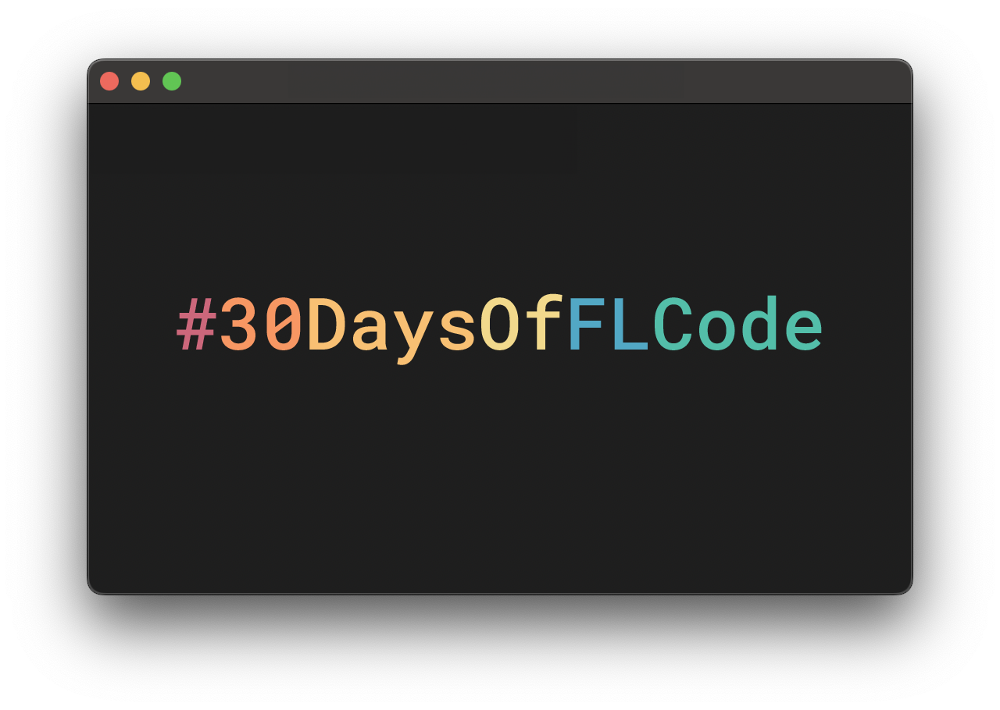

# 🚀 30 Days of Federated Learning Code (#30DaysOfFLCode)

Welcome to my repository! 🎯  

  

This is my journey into the world of **Federated Learning (FL)**, where I explore its concepts, techniques, and real-world applications. Over the next 30 days, I will dedicate time daily to learning and documenting my progress here. 🌐🔒  

## 🎯 Challenge Goals  

1️⃣ **Daily Learning**: Spend at least 1 hour each day studying Federated Learning.  
2️⃣ **Daily Updates**: Share reflections, insights, and takeaways from each session.  
3️⃣ **Collaboration**: Connect with others passionate about FL and machine learning to share knowledge and ideas.  

## 📚 What to Expect  

This repository will feature:  
- **Daily Updates**: Logs and insights from each day’s learning.   
- **Mini Projects (if applicable)**: Hands-on implementation of FL concepts.  

## 🌟 Why Federated Learning?  

Federated Learning is a cutting-edge approach to training machine learning models while ensuring data privacy. It enables collaboration across decentralized datasets without transferring raw data, opening doors to exciting possibilities in AI and privacy.  

## 📝 Daily Progress  

- **Day 1**: Introduction to Federated Learning.  

*(Progress will be updated daily!)*

## 💬 Let’s Connect!  

If you’re also exploring Federated Learning or have resources to share, feel free to:  
- **Follow the journey**: Stay tuned for updates here or on [LinkedIn](https://www.linkedin.com/in/pradeep-sahani-32ab29195/).  

Email - sahanipradeep5529@gmail.com
